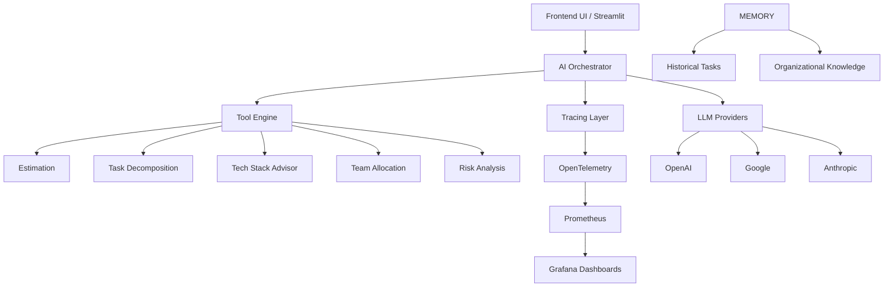
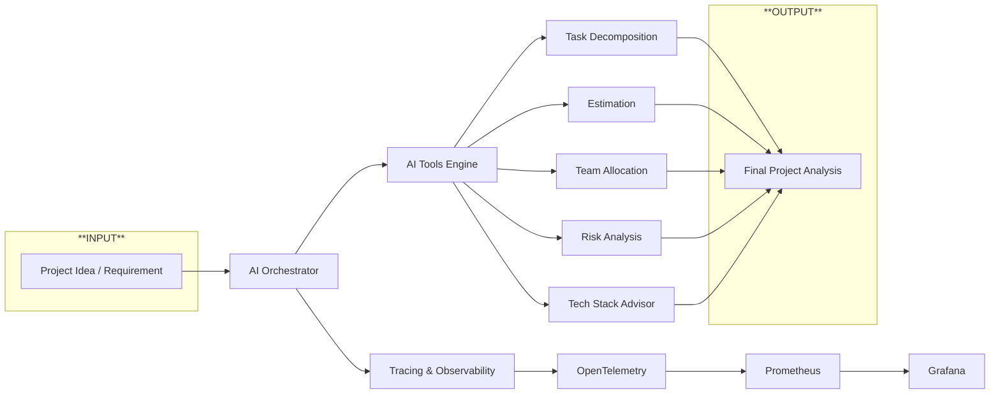

# Estimates AI

## Table of Contents

- [Estimates AI](#estimates-ai)
  - [Table of Contents](#table-of-contents)
  - [Description](#description)
  - [Stakeholders \& ROI](#stakeholders--roi)
    - [Stakeholders](#stakeholders)
    - [ROI](#roi)
  - [Architecture Overview](#architecture-overview)
  - [Main Components](#main-components)
    - [AI Orchestrator](#ai-orchestrator)
    - [Tool Engine](#tool-engine)
      - [Available tools](#available-tools)
    - [Tracing \& Observability](#tracing--observability)
  - [Estimation Logic](#estimation-logic)
  - [Workflow](#workflow)
  - [Dependencies](#dependencies)
    - [Core](#core)
    - [GUI](#gui)
    - [Datapizza-AI](#datapizza-ai)
    - [Tracing \& Monitoring](#tracing--monitoring)
  - [Configuration](#configuration)
  - [Future Improvements](#future-improvements)
  - [Vision](#vision)

## Description

Estimates AI is an AI-powered project intelligence and task estimation system designed to help teams quantify the human effort required to start and complete a task.

The platform analyzes project requirements and generates structured insights by using tools able to do:
- task decomposition;
- workload estimation;
- team allocation;
- architectural suggestions;
- risk analysis;
- dependency mapping.

The estimation process is based on multiple contextual factors, including:

- activity type (`feature`, `bugfix`, `chore`, `refactor`);
- integrations with external services;
- technical complexity;
- team composition and skill distribution;
- historical organizational knowledge.

The goal of the project is not only to estimate tasks, but also to provide explainable AI-assisted planning and operational decision support.

## Stakeholders & ROI

### Stakeholders

Here is a list of potential stakeholders and their related interests.

- CEO / Founder: marginality, speed of delivery, cost forecast.
- CTO: governance technique.
- Project Manager: distribution task, sprint planning, dependencies, risk assessment.
- Tech Lead / Engineering Manager: skill gap identification, stack choice, realistic technical effort.
- Development team: clearer tasks, lower scheduling overhead, automatic documentation.
- QA / Test Manager: estimate effort testing, coverage, QA automation.
- Final customers: cost transparency, roadmap, realistic times.

### ROI

Here is a possible return on investment, in terms of time and money.

Analysis and planning phase:
- 20–50% reduction in planning time;
- 15–30% PM/Lead effort reduction;
- 10–25% less rework from poorly defined tasks.

Software development phase:
- 30–60% reduction in pre-sales time;
- 20–40% best accuracy estimates;
- commercial win-rate increase.

Process management phase:
- 10–30% operational improvement;
- especially in multi-team companies.

## Architecture Overview

The system follows a modular AI-oriented architecture composed of:



## Main Components

### AI Orchestrator

Coordinates the entire workflow:
- tool execution;
- tracing and observability.

### Tool Engine

Responsible for specialized AI operations.

#### Available tools

- Task decomposition tool
- Estimation tool
- Team allocation tool
- Risk analysis tool
- Tech stack advisor tool

### Tracing & Observability

Used for:
- AI explainability;
- debugging;
- execution tracing;
- performance monitoring;
- auditability.

Powered by:
- OpenTelemetry;
- Prometheus;
- Grafana.

Grafana dashboards can be used to monitor:
- AI latency;
- token usage;
- tool execution;
- estimation performance;
- error rate;
- workflow metrics;
- orchestration traces.

## Estimation Logic

The estimation engine evaluates:
- task complexity;
- scope size;
- impacted modules;
- architectural dependencies;
- external integrations;
- team capacity.

The output may include:
- estimated hours;
- confidence score;
- risk level;
- suggested team composition;
- possible bottlenecks.

## Workflow

Starting from a project idea, the engine analyzes the input.

The request is then decomposed into smaller tasks, which are independently analyzed to estimate complexity, implementation time, risks, dependencies, and required team roles. During the process, the engine may also suggest architectural solutions and alternative tech stacks.

All operations are traced through the observability layer in order to provide explainability, monitoring, and performance insights.

The final output is a complete project analysis containing:

- task decomposition;
- workload estimation;
- team allocation;
- risk assessment;
- architectural recommendations;
- delivery bottlenecks.



## Dependencies

### Core

- `python-dotenv`
- `pandas`
- `pydantic`

### GUI
- `streamlit`

### Datapizza-AI

- `datapizza-ai`
- `datapizza-ai-clients-openai`
- `datapizza-ai-clients-openai-like`
- `datapizza-ai-clients-google`
- `datapizza-ai.clients.anthropic`
- `datapizza-ai-cache-redis`

### Tracing & Monitoring

- `opentelemetry-sdk`
- `opentelemetry-exporter-otlp-proto-grpc`
- `opentelemetry-exporter-prometheus`
- `prometheus-client`
- `grafana`

## Configuration

1. Install [Python >=3.11](https://www.python.org/downloads/) on your machine.

    After installing Python, synchronize the project dependencies with [uv](https://github.com/astral-sh/uv):

    ```bash
    uv sync
    ```

2. Create the `.env` file in the root directory based on `.env.example`.

    ```bash
    cp .env.example .env
    ```

3. Search and install the Jupyter extension in Visual Studio Code.It is used to execute Python code blocks interactively.

4. Install [Docker](https://docs.docker.com/engine/install/), build and run the application:

    ```bash
    docker compose up --build
    ```

5. Run this command to start

    ```bash
    uv run main.py
    ```

## Future Improvements

- memory caching with Redis;
- multi-agent orchestration;
- AI-assisted sprint planning;
- automatic Jira/Teams Task integration;
- graph-based dependency analysis;
- historical comparison between similar projects;
- generation of documentation for each specific team (e.g. technical docs vs functional docs);
- cost optimization recommendations;
- autonomous project simulations.

## Vision

The long-term vision of the project is to create an AI-native operational intelligence platform capable of combining:
- planning;
- estimation;
- workflow orchestration;

The system aims to become an intelligent layer between business requirements and technical execution.
