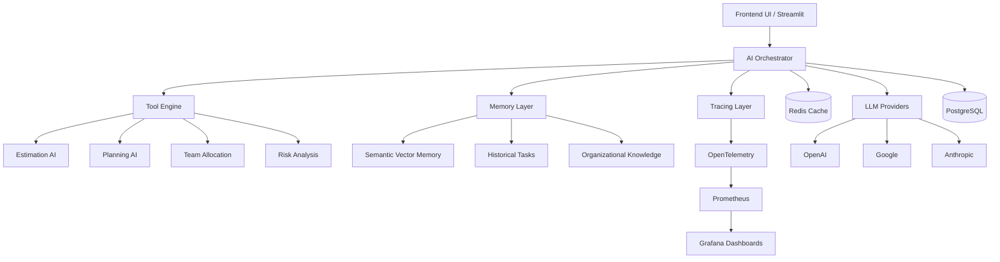

# Estimates AI

## Table of Contents

- [Estimates AI](#estimates-ai)
  - [Description](#description)
  - [Architecture Overview](#architecture-overview)
  - [Main Components](#main-components)
    - [AI Orchestrator](#ai-orchestrator)
    - [Tool Engine](#tool-engine)
      - [Available tools](#available-tools)
    - [Memory Layer](#memory-layer)
      - [Includes](#includes)
    - [Tracing \& Observability](#tracing--observability)
  - [Estimation Logic](#estimation-logic)
  - [Tech Stack](#tech-stack)
    - [Backend](#backend)
    - [AI Framework](#ai-framework)
    - [Tracing \& Monitoring](#tracing--monitoring)
    - [Infrastructure](#infrastructure)
  - [Dependencies](#dependencies)
    - [Python](#python)
    - [Datapizza-AI](#datapizza-ai)
    - [Context Tracing](#context-tracing)
    - [Other](#other)
  - [Configuration](#configuration)
    - [Running Streamlit](#running-streamlit)
  - [Future Improvements](#future-improvements)
  - [Vision](#vision)

## Description

Estimates AI is an AI-powered project intelligence and task estimation system designed to help teams quantify the human effort required to start and complete a task.

The platform analyzes project requirements and generates structured insights such as:

- task decomposition;
- workload estimation;
- team allocation;
- architectural suggestions;
- risk analysis;
- dependency mapping;
- historical project comparisons.

The estimation process is based on multiple contextual factors, including:

- activity type (`feature`, `bugfix`, `chore`, `refactor`);
- number of files or impacted areas;
- integrations with external services;
- technical complexity;
- team composition and skill distribution;
- historical organizational knowledge.

The goal of the project is not only to estimate tasks, but also to provide explainable AI-assisted planning and operational decision support.

## Architecture Overview

The system follows a modular AI-oriented architecture composed of:



## Main Components

### AI Orchestrator

Coordinates the entire workflow:
- prompt routing;
- tool execution;
- memory retrieval;
- estimation pipelines;
- tracing and observability.

### Tool Engine

Responsible for specialized AI operations.

#### Available tools

- Task decomposition tool
- Estimation tool
- Team allocation tool
- Risk analysis tool
- Dependency analyzer
- Tech stack advisor
- Historical similarity search
- Documentation generator

### Memory Layer

Stores organizational and semantic knowledge.

#### Includes

- short-term contextual memory;
- semantic vector memory;
- historical project memory;
- organizational knowledge base.

### Tracing & Observability

Used for:
- AI explainability;
- debugging;
- execution tracing;
- performance monitoring;
- auditability.

Powered by:
- OpenTelemetry;
- Prometheus;
- Grafana.

Grafana dashboards can be used to monitor:
- AI latency;
- token usage;
- tool execution;
- estimation performance;
- error rate;
- workflow metrics;
- orchestration traces.

## Estimation Logic

The estimation engine evaluates:
- task complexity;
- scope size;
- impacted modules;
- architectural dependencies;
- external integrations;
- historical similarities;
- team capacity.

The output may include:
- estimated hours;
- confidence score;
- risk level;
- suggested team composition;
- possible bottlenecks.

## Tech Stack

### Backend

- Python
- Streamlit
- Pydantic
- Pandas

### AI Framework

- datapizza-ai
- datapizza-ai-clients-openai
- datapizza-ai-clients-openai-like
- datapizza-ai-clients-google
- datapizza-ai.clients.anthropic
- datapizza-ai-cache-redis

### Tracing & Monitoring

- opentelemetry-sdk
- opentelemetry-exporter-otlp-proto-grpc
- opentelemetry-exporter-prometheus
- prometheus-client
- grafana

### Infrastructure

- Docker
- Redis
- PostgreSQL

## Dependencies

### Python

- Python >=3.11  

### Datapizza-AI

- `datapizza-ai`
- `datapizza-ai-clients-openai`
- `datapizza-ai-clients-openai-like`
- `datapizza-ai-clients-google`
- `datapizza-ai.clients.anthropic`
- `datapizza-ai-cache-redis`

### Context Tracing

- `opentelemetry-sdk`
- `opentelemetry-exporter-otlp-proto-grpc`
- `opentelemetry-exporter-prometheus`
- `prometheus-client`
- `grafana`

### Other

- `pandas`
- `python-dotenv`
- `pydantic`
- `streamlit`

## Configuration

1. Install Python on your machine.

2. Create the `.env` file in the root directory based on `.env.example`.

    ```bash
    cp .env.example .env
    ```

3. Search and install the Jupyter extension in Visual Studio Code.It is used to execute Python code blocks interactively.

4. Build and run the application:

    ```bash
    docker compose up --build
    ```

### Running Streamlit

If using Streamlit:

```bash
streamlit run nome_file_creato.py
```

## Future Improvements

- multi-agent orchestration;
- predictive delivery forecasting;
- AI-assisted sprint planning;
- automatic Jira/Azure DevOps integration;
- graph-based dependency analysis;
- organizational learning loops;
- cost optimization recommendations;
- autonomous project simulations.

## Vision

The long-term vision of the project is to create an AI-native operational intelligence platform capable of combining:
- planning;
- estimation;
- organizational memory;
- workflow orchestration;
- decision support;
- explainable AI.

The system aims to become an intelligent layer between business requirements and technical execution.
